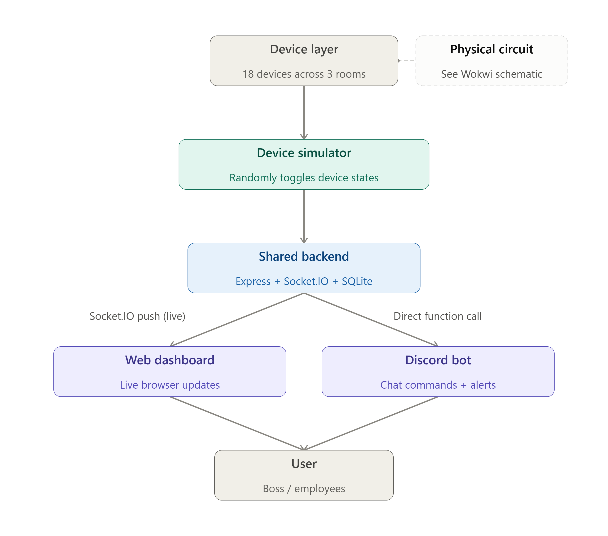

# Smart Office Monitor — IUT Techathon Nationals & Rover Summit

A simulated IoT smart-office system for a 3-room office (Drawing Room, Work Room 1, Work Room 2 — 2 fans + 3 lights per room, 15 devices total). One shared Node.js backend is the single source of truth; a real-time 3D web dashboard and a Discord bot both read and act on the same live (simulated) device state.

Built for the **"Lights, Fans, Discord: The Boss's Big Idea"** hackathon problem statement (Techathon Nationals & Rover Summit / IUT Robotics Society).

> Team: Sayem, Emon, Lamia, Riyad

---

## Table of Contents

- [Problem Statement Recap](#problem-statement-recap)
- [Architecture](#architecture)
- [Repository Layout](#repository-layout)
- [Data Model](#data-model)
- [Getting Started](#getting-started)
- [Backend](#backend)
- [Web Dashboard](#web-dashboard)
- [Discord Bot](#discord-bot)
- [Circuit Schematic (Wokwi)](#circuit-schematic-wokwi)
- [System Diagram](#system-diagram)
- [Alerts Logic](#alerts-logic)
- [Environment Variables](#environment-variables)
- [Security Notes](#security-notes)

---

## Problem Statement Recap

A small office loses money because people leave lights and fans running after hours. Everything at the office already happens on Discord, so the brief asks for one shared backend that powers both:

1. A **live web dashboard** — device grid, power meter, alerts.
2. A **Discord bot** — `!status`, `!room <name>`, `!usage`, answering from the same live data.

No physical hardware is required; device state is simulated but dynamic, and both interfaces must read from a single source of truth. Full requirements are in [`Hackathon Problem Statement (Preliminary Round) v1.2.pdf`](./Hackathon%20Problem%20Statement%20(Preliminary%20Round)%20v1.2.pdf); the team's internal planning notes are in [`IUT_plan.png`](./IUT_plan.png).


### Dashboard Interface Preview


## Architecture

```
[Simulator (setInterval)]
        |
        v
 [SQLite (office.db)]  <-- single source of truth for device state, readings, alerts
        |
        +--------------------------+
        v                          v
[Express REST API]          [Discord bot (discord.js)]
[Socket.IO server]          (calls db.js functions directly —
        |                    same Node process, no HTTP hop)
        v
[React dashboard]
(Socket.IO client, live updates, no page refresh)
```

Both the REST API and the Discord bot call the exact same query functions in [`backend/db.js`](./backend/db.js) / [`backend/store.js`](./backend/store.js). Nothing is duplicated or hardcoded per-interface — a number shown on the dashboard and a number reported by `!usage` at the same instant will always match, because they come from the same read.

**Backend responsibilities** (all in one Node process, `backend/server.js`):
- `simulator.js` ticks every `SIM_INTERVAL_MS` (default 30s), randomly toggles 1–2 devices, recomputes power totals, logs a `readings` row, evaluates alert conditions, and logs any triggered `alerts`.
- `store.js` is the domain layer: room resolution/aliases, power metrics, formatted status/usage strings (shared by both the API and the bot), and alert-rule evaluation.
- `db.js` is the persistence layer: SQLite schema, seeding, and raw queries (`better-sqlite3`, WAL mode).
- `server.js` wires up Express REST routes and a Socket.IO server, broadcasting `deviceUpdate` / `usageUpdate` / `alertsUpdate` on every simulator tick and on every manual toggle.
- `bot.js` is a discord.js client that listens for commands and (optionally) proactively posts alerts to a Discord channel — see [Discord Bot](#discord-bot).

## Repository Layout

```
iut new/
├── backend/                  Express + Socket.IO + SQLite + Discord bot (single process)
│   ├── server.js              REST API, Socket.IO, boots simulator + bot
│   ├── simulator.js           Periodic device-state simulator
│   ├── store.js                Domain logic shared by API + bot (rooms, power, alerts, message text)
│   ├── db.js                  SQLite schema, seeding, and queries (source of truth)
│   ├── bot.js                 Discord bot: commands + proactive alert watcher
│   └── .env.example           Backend config template
├── frontend/                  React + Vite dashboard
│   └── src/
│       ├── App.jsx             Dashboard shell: stat tiles, power panel, alerts, room controls
│       ├── hooks/useOfficeSignalR.js   Socket.IO client hook (REST snapshot + live updates)
│       ├── components/SmartOffice3D.jsx  3D office visualization (react-three-fiber)
│       ├── components/OfficeBlueprint.jsx, PowerGauge.jsx, StatusPanel.jsx, AlertsTicker.jsx, DeviceIcon.jsx
│       └── data/officeDevices.js       Static room/device layout + fallback data
├── Bot.md                     Step-by-step Discord bot build tutorial (dev notes)
├── database.md                 SQLite schema/design rationale (dev notes)
├── IUT_plan.png                Internal architecture/planning sketch
├── Hackathon Problem Statement (Preliminary Round) v1.2.pdf
└── package.json                 Root npm workspace (runs backend + frontend together)
```

## Data Model

Every device is one row, and the exact same JSON shape flows through the DB, the REST API, the Socket.IO payload, and the Discord bot — no translation layer:

```json
{
  "id": "work-room-1-fan-1",
  "name": "Fan 1",
  "type": "fan",
  "room": "Work Room 1",
  "status": "on",
  "power_draw_watts": 60,
  "last_changed": "2026-07-03T14:32:00.000Z"
}
```

- 3 rooms × (2 fans @ 60W + 3 lights @ 15W) = **18 devices**, seeded once in `backend/db.js`.
- `readings` table: one snapshot per simulator tick (`total_watts` + per-room watts), used to estimate `kWh` for `!usage` and the dashboard.
- `alerts` table: every triggered anomaly (`after_hours`, `continuous_2hr`), timestamped, so alert history survives a backend restart.

See [`database.md`](./database.md) for the full schema rationale and [`Bot.md`](./Bot.md) for the bot's step-by-step build notes.

## Getting Started

**Requirements:** Node.js 18+ (for native `fetch`), npm.

```bash
# from the repo root
npm install
npm run dev
```

This uses npm workspaces + `concurrently` to start both processes:

- Backend → `http://localhost:5000`
- Frontend (Vite) → `http://localhost:5173`

Before running, copy the env templates and fill in real values:

```bash
cp backend/.env.example backend/.env
cp frontend/.env.example frontend/.env
```

See [Environment Variables](#environment-variables) — the Discord bot is optional and the backend runs fine without `DISCORD_TOKEN` set.

## Backend

| Route | Method | Description |
|---|---|---|
| `/health` | GET | Liveness check + device count |
| `/api/devices` | GET | All 18 devices, current state |
| `/api/usage` | GET | Total watts, per-room breakdown, today's estimated kWh |
| `/api/alerts` | GET | Most recent alerts |
| `/api/devices/:id/toggle` | PATCH | Manually flip a device (also broadcasts the update) |

**Socket.IO events** (server → client): `deviceUpdate`, `usageUpdate`, `alertsUpdate`, emitted on connect, on every simulator tick, and on every toggle. **Client → server:** `toggleDevice` (with ack callback).

Run backend alone:

```bash
cd backend
npm install
npm run dev   # node --watch server.js
```

## Web Dashboard

React + Vite + Tailwind, with a `react-three-fiber` 3D office visualization (`SmartOffice3D.jsx`) driven by the same live Socket.IO state as the 2D panels.

- **Live Device Status** — every device grouped by room, toggleable, with on/off state driven by `useOfficeSignalR` (an initial REST snapshot, then live Socket.IO pushes — no page refresh, per spec requirement #3).
- **Power Panel** — total office wattage, a load bar, and a per-room breakdown bar.
- **Alerts Panel** — most recent anomalies (after-hours / continuously-on) with room and timestamp.
- **3D/Blueprint visualization (bonus)** — lights and fans rendered in 3D per room, reflecting live on/off state (see `SmartOffice3D.jsx`, `OfficeBlueprint.jsx`).

Run frontend alone:

```bash
cd frontend
npm install
npm run dev
```

## Discord Bot

Lives in the **same Node process** as the backend (`backend/bot.js`, started from `server.js`) so it reads from the exact same SQLite-backed store as the dashboard — satisfying the "single source of truth" requirement without an HTTP hop.

| Command | Behavior |
|---|---|
| `!status` | Per-room summary of fans/lights ON, e.g. *"Drawing Room: 1 fan ON, 2 lights ON. Work Room 1: all off. Work Room 2: 2 fans ON, 3 lights ON."* |
| `!room <name>` | Status of one room. Accepts aliases: `drawing`/`draw`/`drawing room`, `work1`/`wr1`/`work room 1`, `work2`/`wr2`/`work room 2`. |
| `!usage` | Total watts right now + today's estimated kWh + per-room breakdown. |
| `!help` | Lists available commands. |

**Humanized responses (optional):** if `ANTHROPIC_API_KEY` is set, every reply is rephrased by an LLM into a friendlier sentence (`bot.js`'s `humanize()`), with a 4s timeout and a hard fallback to the raw factual string on any failure — the bot never hangs or breaks the demo waiting on an LLM call. Leave the key unset to get plain factual responses.

**Proactive alerts (bonus):** if `ALERT_CHANNEL_ID` is set, the bot polls the alerts table every 30s and posts newly-triggered alerts (e.g. a room left on after hours) directly to that Discord channel, unprompted.

Setup steps (Developer Portal application, bot token, intents, invite link) are documented in detail in [`Bot.md`](./Bot.md).

## Circuit Schematic (Wokwi)

**Live project:** [wokwi.com/projects/468547976515293185](https://wokwi.com/projects/468547976515293185)

This is the representative hardware design for **one room (Work Room 1)** — a real ESP32 wired to relay-driven fans/lights, physical toggle buttons, and an analog current-sense input, matching what a real deployment would use to drive/sense the same 5 devices the simulator models for that room.

**Board:** ESP32 (Wokwi "ESP32 Native Core 3.0+" board)

| Function | GPIO | Notes |
|---|---|---|
| Fan 1 relay (on/off) | GPIO 16 | Digital output → relay module → fan load |
| Fan 2 relay (on/off) | GPIO 17 | Digital output → relay module → fan load |
| Light 1 relay | GPIO 18 | Digital output → relay module → light load |
| Light 2 relay | GPIO 19 | Digital output → relay module → light load |
| Light 3 relay | GPIO 21 | Digital output → relay module → light load |
| Fan 1 PWM (speed) | GPIO 13 | Optional variable-speed control channel |
| Fan 2 PWM (speed) | GPIO 14 | Optional variable-speed control channel |
| Button — toggle Fan 1 | GPIO 25 | `INPUT_PULLUP`, debounced |
| Button — toggle Fan 2 | GPIO 26 | `INPUT_PULLUP`, debounced |
| Button — toggle Light 1 | GPIO 27 | `INPUT_PULLUP`, debounced |
| Button — toggle Light 2 | GPIO 32 | `INPUT_PULLUP`, debounced |
| Button — toggle Light 3 | GPIO 33 | `INPUT_PULLUP`, debounced |
| Current sensor (analog) | GPIO 34 | Simulated via potentiometer; scales reported wattage 0.9x–1.1x to mimic real-world load variance |

**Logic implemented in the sketch:**
- Each button is debounced with a 250ms lockout to prevent switch chatter from double-toggling a relay.
- Power draw is computed from known per-device wattage (fan = 60W, light = 15W) rather than assumed constant, then adjusted by the analog "current sensor" reading — mirroring how a real clamp/shunt current sensor would report actual (not nominal) draw.
- The board reports full device state + computed wattage as JSON over serial every 10 seconds, and immediately on any button press — the same event-driven-plus-heartbeat pattern the backend simulator uses (`SIM_INTERVAL_MS` tick + immediate broadcast on toggle).
- Only one room's 5 devices are wired here, as permitted by the spec ("you don't have to wire all 18 devices; a representative circuit for one room is enough"); the same relay/button/current-sense pattern would be replicated per room (or multiplexed onto a single ESP32 with more GPIOs / an I/O expander) for a full 18-device deployment.

## System Diagram

> **TODO:** the formal high-level system diagram (device → simulator → backend → dashboard + bot → user) required by the spec is not yet added to the repo. Add the diagram image (drawn manually or with a non-Mermaid tool, per the spec's constraint) and reference it here, e.g.:
>

## System Diagram


> ```
>
> The [Architecture](#architecture) section above and [`office_iot_system_diagram.png`](./office_iot_system_diagram.png) (internal planning sketch) describe the same data flow in the meantime.

## Alerts Logic

Implemented in `store.js`'s `buildAlertRows()`, evaluated every simulator tick:

- **After-hours:** any device still `on` outside 9 AM–5 PM triggers an `after_hours` alert for that device.
- **Continuous 2-hour run:** if every currently-on device in a room has been on continuously for over 2 hours (based on the oldest `last_changed` among that room's active devices), a `continuous_2hr` alert fires for the room.

Every alert is persisted with a timestamp (`alerts` table) so the dashboard's Alerts Panel and the Discord bot's proactive channel post always agree, and history survives a restart.

## Environment Variables

**`backend/.env`** (see `backend/.env.example`):

| Variable | Required | Description |
|---|---|---|
| `PORT` | No (default `5000`) | Backend HTTP/Socket.IO port |
| `FRONTEND_ORIGIN` | No (default `http://localhost:5173`) | CORS origin allowed to hit the API/socket |
| `SIM_INTERVAL_MS` | No (default `30000`) | Simulator tick interval, clamped to 5s–60s |
| `DISCORD_TOKEN` | No | Discord bot token; leave unset to run without the bot |
| `ALERT_CHANNEL_ID` | No | Discord channel ID for proactive alert posts |
| `ANTHROPIC_API_KEY` | No | Enables LLM-humanized bot responses; falls back to plain text if unset/unreachable |
| `ANTHROPIC_MODEL` | No | Overrides the default Anthropic model used for humanizing |

**`frontend/.env`** (see `frontend/.env.example`):

| Variable | Description |
|---|---|
| `VITE_API_URL` | Backend REST base URL (default `http://localhost:5000`) |
| `VITE_SOCKET_URL` | Backend Socket.IO URL (default same as API URL) |

## Security Notes

- `.env` files are git-ignored; only `.env.example` templates are committed.
- **Rotate the Discord bot token before submission/publication.** At the time of writing, `backend/.env` (local, untracked) and the committed `backend/.env.example` both contain what appear to be live-looking Discord token/channel values rather than placeholders — treat any token that has ever been written to a tracked file as compromised, regenerate it from the Discord Developer Portal, and replace `.env.example` with placeholder text (e.g. `DISCORD_TOKEN=`) before making the repository public.
